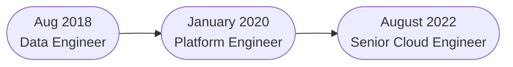

# About Me

**Senior Cloud Engineer @ Scotiabank**  
Tech Lead for the Global Data and Engineering Platform  
Customer Insights Data and Analytics

## Experience

 

### Senior Cloud Engineer

We are developing the next gen Data and analytics platform in public cloud (GCP). We are leveraging Google managed services to accelerate the development data and Analytics tooling. We are managing the deployment and security hardening of cloud resources using Terraform.

[!badge text="Terraform" corners="pill" icon="static\terraformio-icon.svg"] [!badge text="Google Cloud" corners="pill" icon="static\google_cloud-icon.svg"] [!badge text="Python" corners="pill" icon="static\python-logo-only.svg"]

### Platform Engineer

We hosted a multi-tenant Kubernetes cluster on-prem powered by Rancher Kubernetes engine. Developed and operationalized data and analytics tools like Minio (high performance object storage), Airflow, JupyterHub, Spark and Trino.

[!badge text="Kubernetes" corners="pill" icon="static\k8s_logo_with_border.svg"] [!badge text="Minio" corners="pill" icon="static\minio.svg"] [!badge text="Rancher" corners="pill" icon="static\rancher-logo-cow-black.svg"] [!badge text="Python" corners="pill" icon="static\python-logo-only.svg"] 

### Data Engineer

We build data engineering tools to accelerate the development of data engineering pipelines by creating a query optimization and execution engine (Autoflow) along with a frontend UI (Canvas) to provide an integrated development environment for Autoflow.

[!badge text="Java" corners="pill" icon="static\java-icon.svg"] [!badge text="Python" corners="pill" icon="static\python-logo-only.svg"]
